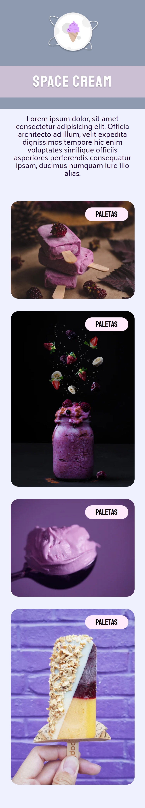

<h1>Desafio do Stage 03 - Mobile First </h1>

 

  

 

## 🚀 Tecnologias

Esse projeto foi desenvolvido com as seguintes tecnologias:

- HTML 
- CSS
- Git 
- Github
- Figma

## 💻 Projeto

Projeto prático da Trilha Explorer da Rocketseat.

- [Acesse o projeto finalizado, online](https://links.hugolino.dev/)

## 🔖 Layout

Você pode visualizar o layout do projeto através [DESSE LINK](https://www.figma.com/file/drBBktNRdtCIUiN4cZk4yo/Stage-03---Mobile-First/duplicate). É necessário ter conta no [Figma](https://figma.com) para acessá-lo.

## Novidades
- Uso de keyframes para animação CSS 

## ✉️ [Contato](https://links.hugolino.dev) 

hugolino2609@gmail.com

